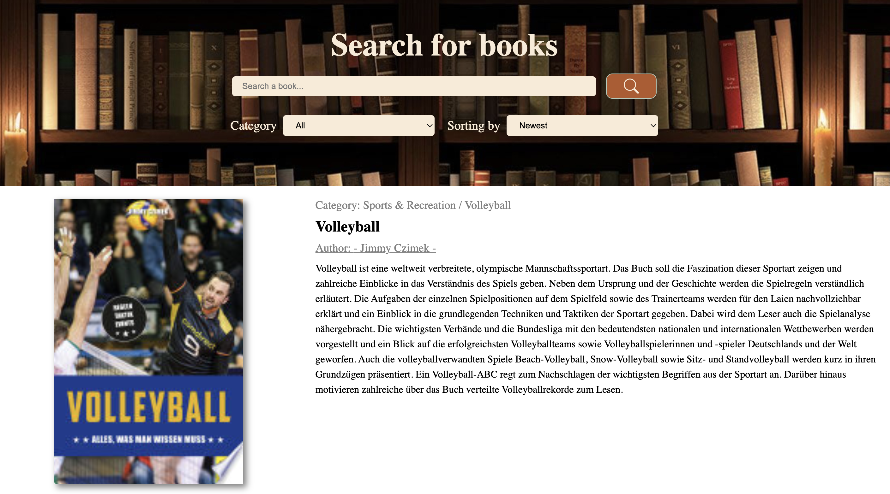

[](https://app.netlify.com/sites/book-search-google/deploys)
# Google Books Search App :open_book:
The Google Books Search App is a user-friendly app that allows you to search for books and discover detailed information about them.

### Books Search app: [deployed on Vercel](https://book-search-steel.vercel.app/)

API: [Google API information](https://developers.google.com/books/docs/v1/using)

## Key features:
- Filtering books by **categories**:
   - all (by default);
   - biography;
   - computers;
   - history;
   - medical;
   - poetry.
- **Sorting** books by:
   - relevance (by default);
   - newest.
- Detailed information about each book;
- Pagination (*Load more button*);

## Key technologies:
- React;
- JavaScript;
- HTML/CSS;
- Redux Toolkit (RTK-query);
- React-router-dom;


## Installation
```
# Step 1: Clone the repository
git clone https://github.com/KatherinaFed/book-search.git

# Step 2: Navigate to the project directory  
cd book-search

# Step 3: Install dependencies 
npm install

# Step 4: Start the app
npm start
```



